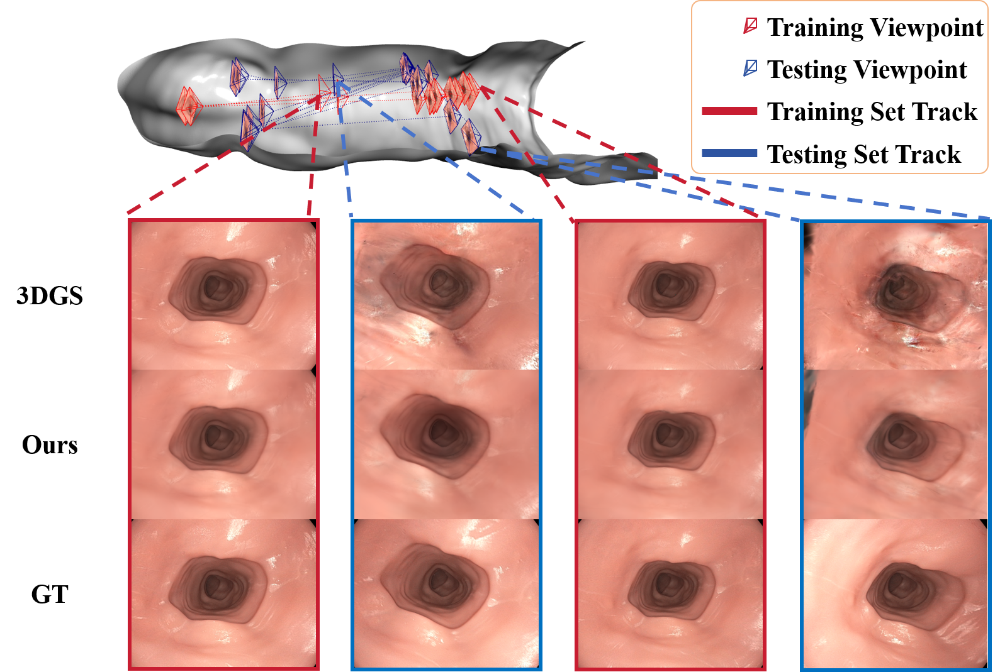
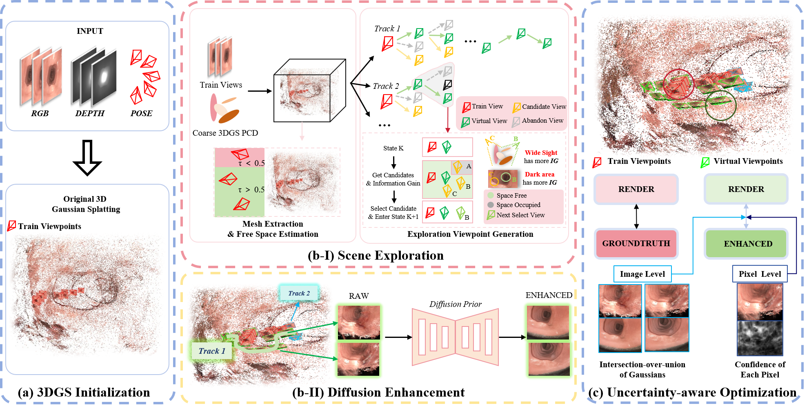

<h1 align="center">
ExtraGS: Enhancing Endoscopic View Extrapolation<br />
via Diffusion-Guided 3D Gaussian Splatting
</h1>

<p align="center">
  Cheng-Tai Hsieh, Jiwei Shan, Han Fang, Jianshu Hu, Tao Ni,<br>
  Lijun Han, Yutong Ban, Shing Shin Cheng, Hesheng Wang
</p>

<p align="center">
  <strong>IEEE/RSJ International Conference on Intelligent Robots and Systems (IROS) 2026</strong>
</p>

<p align="center">
  <a href="https://arxiv.org/abs/2607.12785"></a>
  <a href="https://www.alphaxiv.org/abs/2607.12785"></a>
  <a href="https://github.com/IRMVLab/ExtraGS"></a>
</p>

This repository contains the official implementation of ExtraGS, a diffusion-guided 3D Gaussian Splatting framework for large-baseline endoscopic view extrapolation.

<p align="center">
  
  <br>
  <em>ExtraGS improves endoscopic view extrapolation by exploring under-observed viewpoints and refining the scene with diffusion-enhanced pseudo observations.</em>
</p>

<p align="center">
  
  <br>
  <em>Overview of the ExtraGS pipeline: scene initialization, virtual exploration, diffusion-guided enhancement, and confidence-weighted Gaussian fine-tuning.</em>
</p>

## Installation

Clone with submodules:

```bash
git clone https://github.com/IRMVLab/ExtraGS.git --recursive
cd ExtraGS
```

Create the conda environment:

```bash
conda env create -f environment.yml
conda activate exploregs
```

Install CUDA extensions:

```bash
pip install submodules/simple-knn
pip install submodules/upgrade-diff-gaussian-rasterization
pip install submodules/diff-gaussian-rasterization-fisherrf
```

Install optional preprocessing dependencies as needed:

```bash
pip install -r Depth-Anything-V2/requirements.txt
pip install -r 3DGS_Enhancer_Extra/requirements.txt
pip install openai opencv-python
```

## Checkpoints

The repository does not include large model weights.

Place the diffusion enhancement checkpoint at:

```text
diffusion/ckpt/enhancer.ckpt
```

Place the Depth-Anything-V2 checkpoint at:

```text
Depth-Anything-V2/checkpoints/depth_anything_v2_vitl.pth
```

You can also edit `configs/stage2/diffusion/enhancer.yaml` if your checkpoint paths are different.

## Dataset Layout

Our experiments use the public [C3VDv2](https://durrlab.github.io/C3VDv2/) colonoscopy dataset; download the raw sequences from the [Johns Hopkins Research Data Repository](https://archive.data.jhu.edu/dataset.xhtml?persistentId=doi%3A10.7281%2FT1%2FJC64MK) and convert them with the preprocessing tools below.

In our C3VD experiments, raw C3VD sequences are converted into the Nerfbusters curated-style layout and trained with `--load Nerfbusters`.

### C3VD / Curated Nerfbusters-style Dataset

```text
dataset/nerfbusters-dataset/<scene>/
├── images/
├── images_train/
├── images_test/
├── images_2/
├── depths/                         # optional monocular inverse-depth maps
├── model_train/
│   └── sparse/
│       ├── cameras.{bin,txt}
│       ├── images.{bin,txt}
│       ├── points3D.{bin,txt}
│       └── depth_params.json        # generated when depth regularization is used
└── model_test/
    └── sparse/
```

This is the default layout for C3VD after preprocessing. Use `scripts/run_stage1.sh`, `scripts/run_stage2.sh`, `render.py`, and `metrics.py` for this layout.

For reproducing our released C3VD results, use the swapped Nerfbusters split by passing `swap=1` to the training scripts. In this mode, frames named `frame_1_*` are used as training views and the remaining views are used for evaluation; the loader also reads the initialization point cloud from `model_test/sparse`.

## Data Preprocessing

### 1. Prepare Poses

Run COLMAP or your preferred SfM/SLAM system and export camera intrinsics, poses, and sparse points in COLMAP format. The loaders expect the directory structures shown above.

For endoscopic data, undistort images and keep image names consistent across `images`, `images_2`, COLMAP image records, and depth maps.

For C3VD, use the provided conversion pipeline. The raw input is:

```text
<C3VD_SEQUENCE>/
├── rgb/
├── depth/
└── pose.txt
```

Convert a train/test sequence pair into the curated-style layout:

Before running the command, edit the OpenAI/proxy settings at the top of `data_preprocess/c3vd/prepare_c3vd_curated.sh` if you want automatic caption generation:

```bash
OPENAI_API_KEY="sk-..."
OPENAI_BASE_URL="https://your-relay.example.com/v1"  # optional
OPENAI_MODEL="gpt-4o"
```

Then run:

```bash
bash data_preprocess/c3vd/prepare_c3vd_curated.sh \
  --train-root dataset/c3vd_dataset/c1_a_t1_v1 \
  --test-root dataset/c3vd_dataset/c1_a_t1_v2 \
  --out-root dataset/nerfbusters-dataset/curated_c1_a_t1 \
  --sample-interval 10 \
  --clean-temp 1
```

This creates `images_train/`, sampled `images_test/`, multiresolution images, inverse-depth maps, `model_train/model_test` COLMAP splits, `depth_params.json`, and the diffusion caption file. See `data_preprocess/c3vd/README.md` for details.

### 2. Generate Monocular Depth

Depth regularization is optional but recommended for endoscopic scenes.

```bash
cd Depth-Anything-V2
python run.py \
  --encoder vitl \
  --pred-only \
  --grayscale \
  --img-path ../dataset/nerfbusters-dataset/<scene>/images_2 \
  --outdir ../dataset/nerfbusters-dataset/<scene>/depths
cd ..
```

For C3VD scenes prepared with `data_preprocess/c3vd/prepare_c3vd_curated.sh`, this step is already handled by the pipeline. For other curated-style scenes, replace the image and output paths as needed.

### 3. Estimate Depth Scale Parameters

Depth maps are aligned to sparse COLMAP depth before training:

```bash
python utils/make_depth_scale.py \
  --scene <scene> \
  --dataset nerfbusters-dataset
```

The generated `depth_params.json` is consumed by the `*-with-depth` loaders when `ModelParams.depths` is set in the config, for example in `configs/stage1/depthreg.yaml`.

### 4. Generate Scene Captions for Diffusion Enhancement

The diffusion enhancer uses a CLIP text condition. Before running Stage 2, generate one scene-level caption file for each scene:

```bash
export OPENAI_API_KEY=<your_api_key>

python data_preprocess/gpt_batch_nerfbusters_scene_caption.py \
  --scene_dir dataset/nerfbusters-dataset/<scene> \
  --scene_name <scene> \
  --images_subdir images_train \
  --num_frames 15 \
  --scale 0.5 \
  --model gpt-4o
```

The script samples frames from `<scene_dir>/<images_subdir>`, submits one OpenAI Batch request, polls until completion, and writes:

```text
dataset/nerfbusters-dataset/<scene>/batch_captions_result_<scene>.jsonl
```

Stage 2 expects this exact file name. `diffusion/enhance_utils.py` loads it from `args.source_path` and reads the caption at:

```text
response.body.choices[0].message.content
```

For datasets that use `images` or `images_2` instead of `images_train`, set `--images_subdir` accordingly. If you use an OpenAI-compatible proxy endpoint, also set:

```bash
export OPENAI_BASE_URL=<your_base_url>
```

See `data_preprocess/README.md` for the full script-level reference.

For C3VD scenes prepared with `data_preprocess/c3vd/prepare_c3vd_curated.sh`, this caption step is already handled unless you pass `--skip-gpt 1`.

## Training

### Stage 1: Coarse 3DGS Initialization

C3VD / curated Nerfbusters-style data:

```bash
bash scripts/run_stage1.sh <scene> <gpu_id> depthreg local 1
```

The default Stage-1 depth-regularized config is:

```text
configs/stage1/depthreg.yaml
```

It enables `ModelParams.depths: "depths"` and inverse-depth regularization.

### Stage 2: ExtraGS Virtual Exploration and Fine-tuning

Recommended ExtraGS configuration:

```text
diffusion:   configs/stage2/diffusion/enhancer.yaml
system:      configs/stage2/system/default.yaml
gs:          configs/stage2/gs/full.yaml
uncertainty: configs/stage2/uncertainty/visibility_mask.yaml
virtualcam:  configs/stage2/virtualcam/ours.yaml
```

C3VD / curated Nerfbusters-style data:

```bash
bash scripts/run_stage2.sh \
  <scene> <gpu_id> \
  enhancer default full visibility_mask ours \
  depthreg 30000 local extrags 1
```

The Stage-2 script runs:

1. `train_stage_vcam.py` for virtual camera search and pseudo-input package preparation.
2. `train_stage_diffusion.py` for diffusion-based virtual view enhancement.
3. `train_stage_finetune.py` for confidence-weighted 3DGS fine-tuning.
4. Rendering and metric scripts for evaluation.

## Evaluation

For C3VD / curated Nerfbusters-style data:

```bash
python render.py \
  -s dataset/nerfbusters-dataset/<scene> \
  -cd configs/stage2/diffusion/enhancer \
  -cs configs/stage2/system/default \
  -cg configs/stage2/gs/full \
  -cu configs/stage2/uncertainty/visibility_mask \
  -cv configs/stage2/virtualcam/ours \
  --load Nerfbusters \
  --expname extrags \
  --start_checkpoint output/stage1_depthreg/<scene>_swap/chkpnt30000.pth \
  --swap

python metrics.py \
  -s dataset/nerfbusters-dataset/<scene> \
  -cd configs/stage2/diffusion/enhancer \
  -cs configs/stage2/system/default \
  -cg configs/stage2/gs/full \
  -cu configs/stage2/uncertainty/visibility_mask \
  -cv configs/stage2/virtualcam/ours \
  --expname extrags \
  --start_checkpoint output/stage1_depthreg/<scene>_swap/chkpnt30000.pth \
  --swap
```

## Important Configs

- `configs/stage1/depthreg.yaml`: coarse 3DGS with depth regularization.
- `configs/stage2/virtualcam/ours.yaml`: ExtraGS virtual exploration policy.
- `configs/stage2/gs/full.yaml`: confidence-weighted fine-tuning settings.
- `configs/stage2/uncertainty/visibility_mask.yaml`: uncertainty/masking strategy.
- `configs/stage2/diffusion/enhancer.yaml`: diffusion prior checkpoint and inference settings.

## Repository Structure

```text
ExtraGS/
├── arguments/                 # CLI parameter groups
├── configs/                   # Stage-1 and Stage-2 configs
├── data_preprocess/           # Dataset caption/preprocessing helpers
├── diffusion/                 # Diffusion wrapper utilities
├── gaussian_renderer/         # 3DGS render interfaces
├── masking/                   # Fisher, visibility, and mask utilities
├── scene/                     # Dataset loaders, cameras, Gaussian model, search
├── scripts/                   # End-to-end training/evaluation scripts
├── submodules/                # CUDA rasterizers and simple-knn
├── utils/                     # Camera, confidence, mesh, and depth utilities
├── train_stage1.py
├── train_stage_vcam.py
├── train_stage_diffusion.py
└── train_stage_finetune.py
```

## Acknowledgements

This codebase builds on:

- [ExploreGS](https://github.com/exploregs/exploregs)
- [3D Gaussian Splatting](https://github.com/graphdeco-inria/gaussian-splatting)
- [3DGS-Enhancer](https://github.com/xiliu8006/3DGS-Enhancer)
- [Depth-Anything-V2](https://github.com/DepthAnything/Depth-Anything-V2)
- [Diffusers](https://github.com/huggingface/diffusers)

## Citation

If you find this project useful, please cite:

```bibtex
@inproceedings{hsieh2026extrags,
  title     = {ExtraGS: Enhancing Endoscopic View Extrapolation via Diffusion-Guided 3D Gaussian Splatting},
  author    = {Hsieh, Cheng-Tai and Shan, Jiwei and Fang, Han and Hu, Jianshu and Ni, Tao and Han, Lijun and Ban, Yutong and Cheng, Shing Shin and Wang, Hesheng},
  booktitle = {IEEE/RSJ International Conference on Intelligent Robots and Systems},
  year      = {2026}
}
```

## License

This repository is released for non-commercial research use. See [LICENSE.md](LICENSE.md) for details. Please also follow the licenses of the upstream projects and bundled third-party components.
